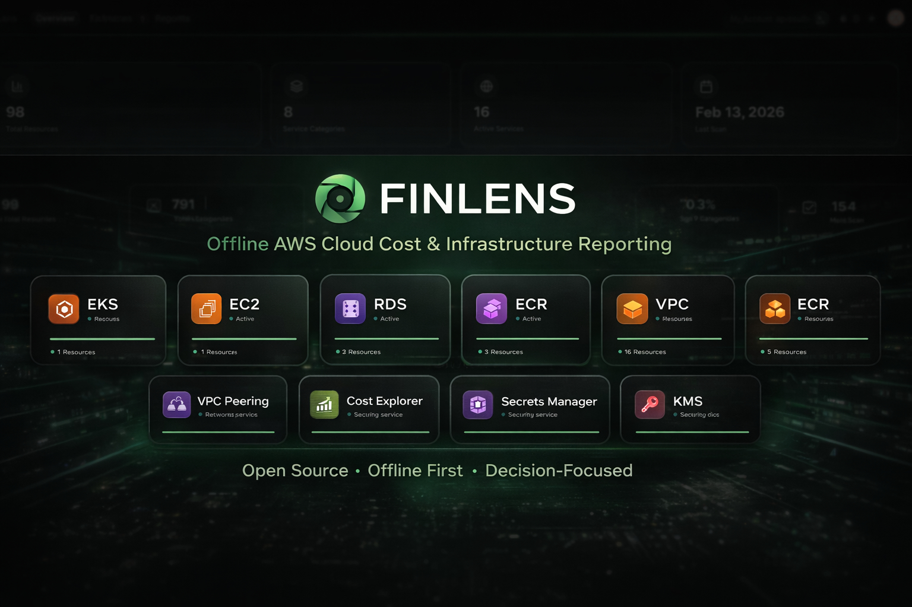
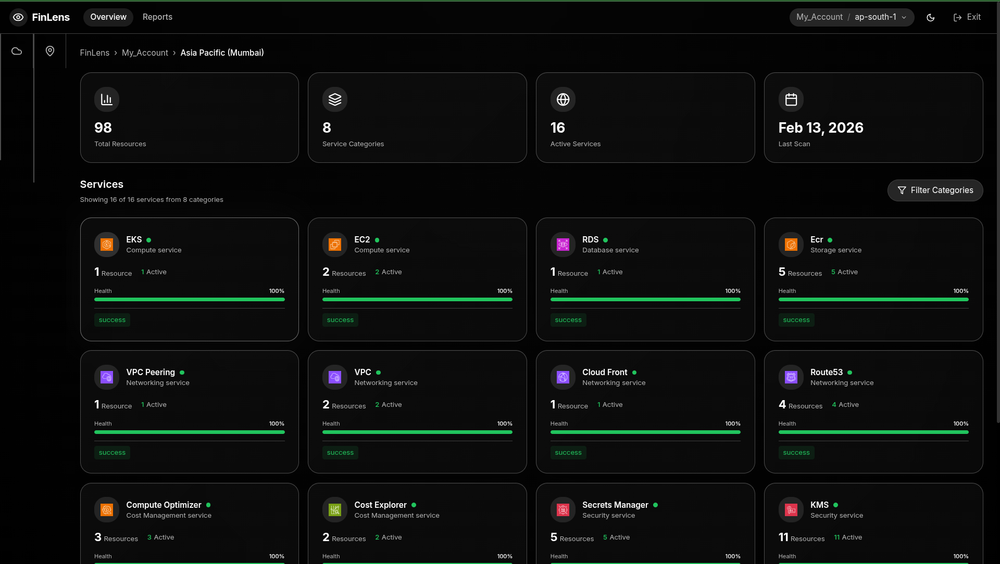
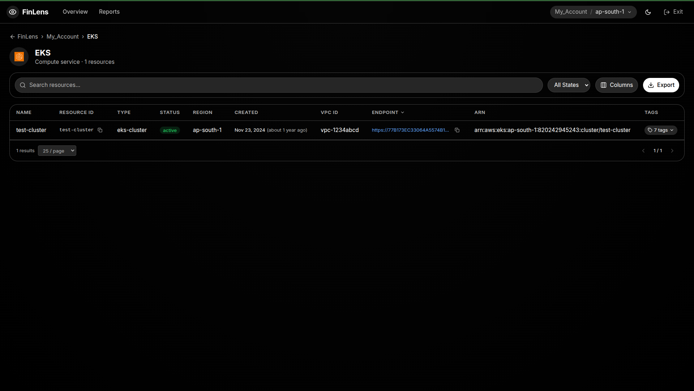
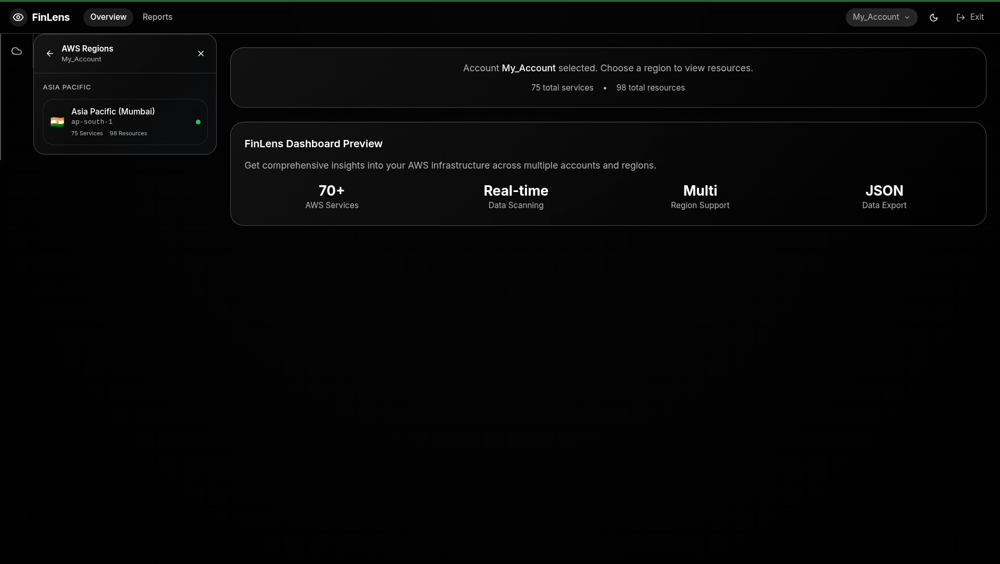

# FinLens — Offline AWS Infrastructure Visibility

<p align="center">
  
</p>

<p align="center">
  <strong>Decision-first cloud visibility for non-technical leaders.</strong>
</p>

<p align="center">
  <a href="PROJECT_OVERVIEW.md"></a>
  <a href="FRD%20%E2%80%94%20Functional%20Requirements%20Document.md"></a>
  <a href="System%20Architecture%20Document%20(SAD).md"></a>
</p>

FinLens converts complex AWS infrastructure into a clear, interactive report you can review locally.

- No SaaS dependency
- No always-on backend requirement
- No live telemetry lock-in
- Deterministic, auditable snapshots

## What FinLens does

1. Runs locally against configured AWS profiles.
2. Collects infrastructure snapshots across selected services and regions.
3. Produces a self-contained web dashboard.
4. Lets teams review cloud posture and inventory clearly.

## Screenshots

### Overview Dashboard


### Service Detail View


### Account Sidebar


### Region Sidebar


## Quick start (Docker recommended)

```bash
./start-finlens.sh
```

Default dashboard URL: `http://localhost:5173`

## Prerequisites

- Python `3.8+`
- Docker + Docker Compose (recommended path)
- AWS credentials configured locally

## Setup

### 1) Configure AWS credentials

```bash
aws configure --profile your-profile-name
aws sts get-caller-identity --profile your-profile-name
```

### 2) Configure FinLens profiles

Update [config/profiles.yaml](config/profiles.yaml):

```yaml
profiles:
  - name: your-profile-name
    environment: production
    enabled: true
```

### 3) Run the platform

```bash
./start-finlens.sh
```

Useful Docker commands:

```bash
docker compose logs -f
docker compose restart
docker compose down
```

## Alternate run modes

### Python direct mode

```bash
pip install -r requirements.txt
cd frontend && npm install && cd ..
python finlens.py
```

### Manual frontend/backend mode

```bash
# Terminal 1
python frontend/api_server.py

# Terminal 2
cd frontend
npm run dev
```

## Core features

- Multi-account inventory with profile-based scanning
- Cross-region coverage with configurable include/exclude regions
- 75+ AWS services across compute, storage, database, networking, security, and more
- Official AWS icon mapping and service-priority overview ordering
- Service detail exports (CSV), column-order preservation, and structured tag popovers
- Interactive dashboards with filtering and drill-downs

## Configuration files

- Profiles: [config/profiles.yaml](config/profiles.yaml)
- Regions: [config/regions.yaml](config/regions.yaml)
- Services: [config/services.yaml](config/services.yaml)

## Troubleshooting

### Profile not found

```bash
ls -la ~/.aws/
cat ~/.aws/credentials
aws sts get-caller-identity --profile your-profile-name
```

If using Docker after credential changes:

```bash
docker compose restart
```

### Docker permission issue

```bash
sudo usermod -aG docker $USER
```

Then log out and log back in.

## Documentation

- Project overview: [PROJECT_OVERVIEW.md](PROJECT_OVERVIEW.md)
- Business requirements: [BRD — Business Requirements Document.md](BRD%20%E2%80%94%20Business%20Requirements%20Document.md)
- Functional requirements: [FRD — Functional Requirements Document.md](FRD%20%E2%80%94%20Functional%20Requirements%20Document.md)
- Non-functional requirements: [NFR — Non-Functional Requirements Document.md](NFR%20%E2%80%94%20Non-Functional%20Requirements%20Document.md)
- Architecture: [System Architecture Document (SAD).md](System%20Architecture%20Document%20(SAD).md)
  - ec2          # EC2 instances
  - vpc          # VPC resources
  # - s3         # Uncomment to add more services
  # - lambda
  # - rds
```

### Step 4: Run FinLens Scan

```bash
# Make sure virtual environment is activated
source venv/bin/activate

# Run the scan
python finlens.py
```

That's it! FinLens will:
- Automatically read all profiles from `config/profiles.yaml`
- Scan only the included regions from `config/regions.yaml`
- Collect data for included services from `config/services.yaml`
- Generate JSON files in `data/<profile-name>/services/` directory

### Output Location

Scan results are saved in:
```
data/
├── profile-1/
│   └── services/
│       ├── ec2.json
│       ├── vpc.json
│       ├── s3.json
│       └── lambda.json
├── profile-2/
│   └── services/
│       ├── eks.json
│       ├── rds.json
│       └── cloudfront.json
```

---

## 🚀 Release 1.0 Highlights

### Enhanced User Experience
- **Professional Branding**: Complete integration of official AWS service icons (59+ services)
- **Theme Flexibility**: Dark/light theme toggle with system preference detection
- **Smart Navigation**: Improved service name formatting with proper spacing ("Secrets Manager" style)
- **Interactive Data Visualization**: DetailSidebar and DataPopover components for enhanced data exploration

### Dynamic Intelligence  
- **Runtime Discovery**: All data loading is dynamic - no static configurations
- **Smart Filtering**: Filter options automatically generated from actual resource data
- **Real-time Insights**: Live resource counts and status indicators
- **Complete Regional Support**: All AWS regions configured with us-east-1 and ap-south-1 as defaults

### Technical Improvements
- **Modern Frontend**: React + TypeScript with Vite for optimal development experience
- **Component Architecture**: Reusable components with proper separation of concerns
- **Performance**: Optimized data loading and responsive UI design
- **Enhanced Interactivity**: Click-to-expand functionality and detailed resource views

---

## 📚 Documentation

- **[Project Overview](PROJECT_OVERVIEW.md)** - Complete project philosophy, goals, and development approach
- **[Business Requirements Document](BRD%20—%20Business%20Requirements%20Document.md)** - Detailed business requirements and scope
- **[Functional Requirements Document](FRD%20—%20Functional%20Requirements%20Document.md)** - Technical specifications and features
- **[System Architecture Document](System%20Architecture%20Document%20(SAD).md)** - Architecture design and implementation details
- **[Data Contract Document](Data%20Contract%20Document.md)** - Data structures and contracts
- **[Non-Functional Requirements](NFR%20—%20Non-Functional%20Requirements%20Document.md)** - Performance, security, and quality requirements

---

## 🤝 Contributing

1. Read the [Project Overview](PROJECT_OVERVIEW.md) to understand our philosophy
2. Check existing documentation for context
3. Submit issues for bugs or feature requests
4. Follow the development approach outlined in our planning documents

---

## 📞 Support

For questions or issues:
1. Check the documentation files listed above
2. Review the troubleshooting section in this README
3. Submit an issue with detailed information about your setup and the problem

---

## 👥 Contributors

- [Jatin-Jaiswal](https://github.com/Jatin-Jaiswal)
- [Aashka Jain](https://github.com/Aashkajain20)

---

**FinLens is built to last, be trusted, and help people think clearly about complex systems.**
